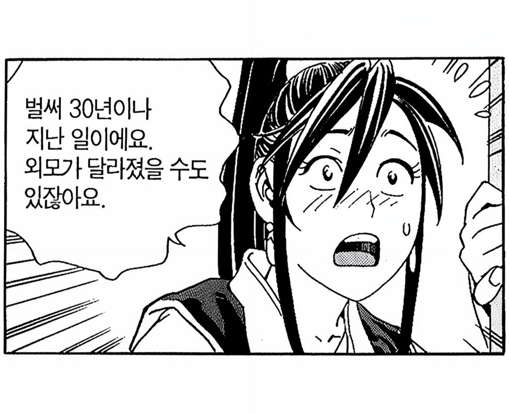
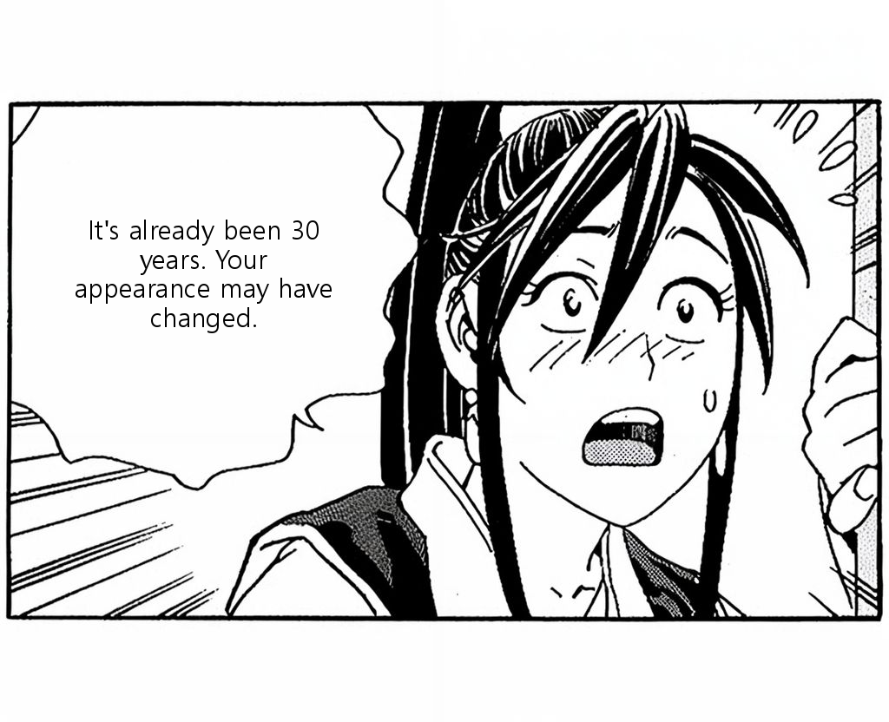
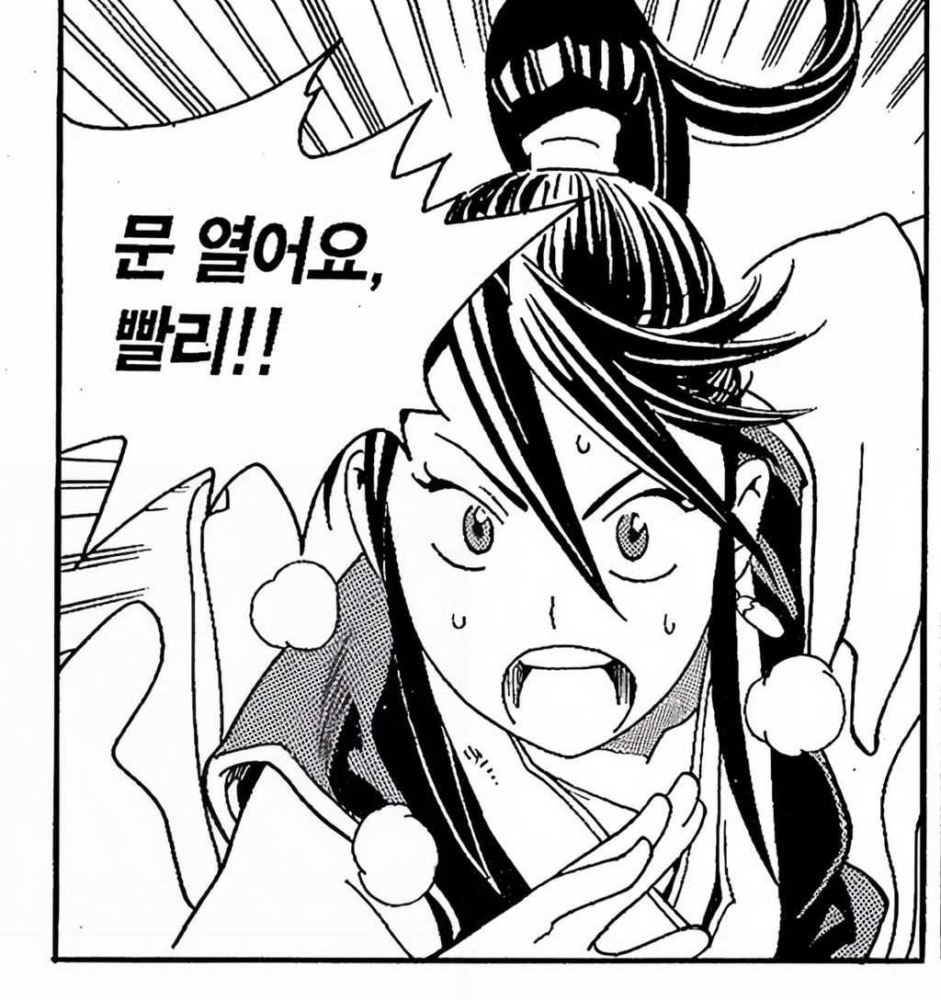
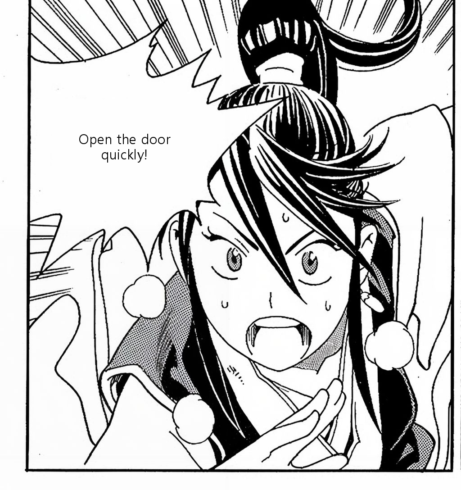
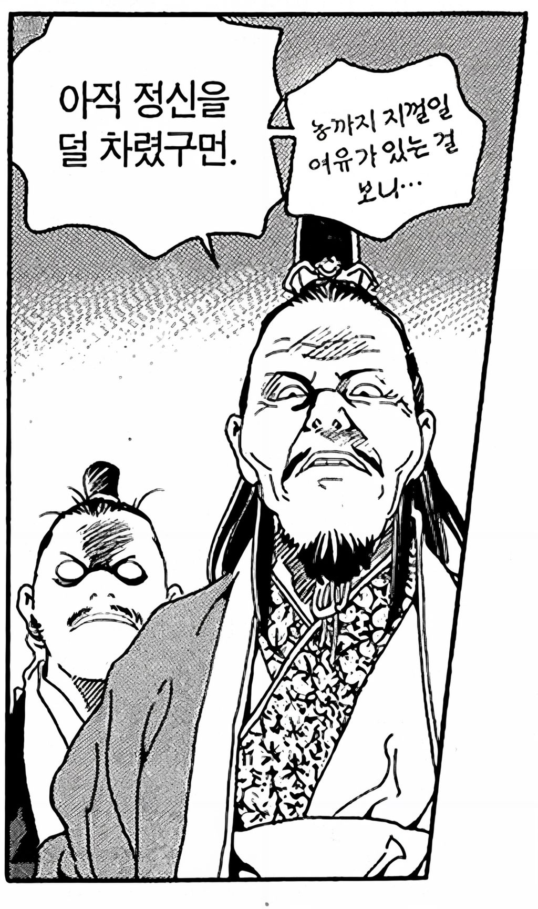
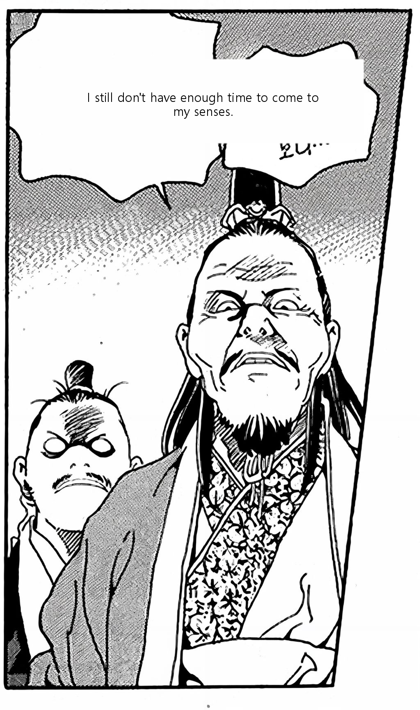

# 🫧 BubbleFit

> **웹툰 이미지를 업로드하면, 말풍선 내 텍스트를 자동으로 인식·번역하고 말풍선 크기에 맞게 자동 배치해주는 작가 도구**


---

## 📌 프로젝트 소개

웹툰을 다른 언어로 번역할 때, 번역된 텍스트의 길이가 원문과 달라져 **말풍선 내부 배치가 어려워지는 문제**가 있습니다.

예를 들어 한국어 "안녕"은 2글자지만, 영어로 번역하면 "Hello"로 5글자가 됩니다.  
반대로 긴 문장이 짧아지는 경우도 있어, 번역 후 말풍선 레이아웃을 **수작업으로 일일이 조정**해야 하는 번거로움이 있습니다.

**BubbleFit**은 이 과정을 컴퓨터 비전 기술로 자동화합니다.

```
웹툰 이미지 업로드
      ↓
말풍선 내 텍스트 인식  (EasyOCR + OpenCV 전처리)
      ↓
텍스트 자동 번역       (Google Translate / DeepL)
      ↓
원본 텍스트 제거       (OpenCV Inpainting)
      ↓
번역 텍스트 자동 배치  (Text Fitting Algorithm)
      ↓
완성된 번역 이미지 출력
```

---

## 🖼️ 결과 예시

> 테스트 이미지 출처: [AI Hub](https://buly.kr/28vbxs7)

| 원본 이미지 | 번역 및 식자 결과 |
|:-----------:|:----------------:|
|  |  |
|  |  |

---

## ⚠️ 한계점 및 향후 개선 방향

> 아래는 현재 파이프라인이 처리하지 못하는 케이스입니다.  
> 실제 테스트 중 발견된 실패 사례를 분석하여 개선 방향을 정리했습니다.

| 원본 이미지 | 처리 결과 | 문제 |
|:-----------:|:---------:|:----:|
|  |  | 인접 말풍선 병합 실패 + 텍스트 누락 |

### 원인 분석

| 케이스 | 원인 | 개선 방향 |
|--------|------|-----------|
| 구름형(삐죽) 말풍선 | 불규칙한 윤곽으로 인해 박스 탐지 범위 벗어남 | 말풍선 contour 기반 개별 탐지 도입 |
| 인접한 복수 말풍선 | `dilate` 커널이 두 박스를 하나로 연결 → 한 말풍선만 처리됨 | 거리 임계값 튜닝 및 말풍선 단위 분리 로직 필요 |
| 작은 폰트 텍스트 | 저해상도 영역에서 EasyOCR 인식률 저하 | 해상도 업스케일(Super Resolution) 전처리 추가 |

---

## 🎯 주요 기능

| 기능 | 설명 |
|------|------|
| 📝 **텍스트 인식 (OCR)** | EasyOCR로 말풍선 내 텍스트 자동 추출 |
| 🔗 **박스 병합** | OpenCV dilate + connectedComponents로 인접 텍스트 박스를 말풍선 단위로 그룹화 |
| 🧹 **텍스트 제거 (Inpainting)** | 주변 픽셀 색상 샘플링으로 배경을 자동 추정하여 자연스럽게 복원 |
| 🌐 **자동 번역** | Google Translate (기본) / DeepL API (선택) |
| 📐 **텍스트 자동 피팅** | 말풍선 크기에 맞춰 폰트 크기·줄바꿈 이진 탐색으로 자동 조정 |
| ✍️ **수동 미세조정** | Streamlit UI에서 번역문을 직접 수정 후 재렌더링 가능 |
| 📥 **이미지 다운로드** | 완성된 번역 이미지 PNG로 저장 |

---

## 🛠️ 기술 스택

| 분류 | 기술 | 용도 |
|------|------|------|
| 이미지 처리 | **OpenCV**, Pillow | 전처리(CLAHE, 가우시안 블러), 박스 병합, Inpainting 경계 스무딩 |
| OCR | **EasyOCR** | 한국어/영어 텍스트 인식 |
| 번역 | **Google Translate**, DeepL API | 텍스트 번역 |
| 텍스트 렌더링 | **Pillow** | 폰트 렌더링, 자동 줄바꿈 |
| 데모 UI | **Streamlit** | 웹 데모 앱 |

---

## 🗂️ 프로젝트 구조

```
BubbleFit/
├── src/
│   ├── ocr.py                # OCR 및 박스 병합 모듈 (OpenCV 전처리 포함)
│   ├── translation.py        # 번역 모듈 (Google / DeepL)
│   ├── text_fitting.py       # 텍스트 자동 피팅 모듈 (이진 탐색)
│   ├── inpainting.py         # 텍스트 제거 및 배경 복원 모듈 (OpenCV)
│   └── pipeline.py           # 전체 파이프라인
├── app/
│   └── streamlit_app.py      # Streamlit 데모 앱
├── result/
│   ├── ST091257.JPEG         # 테스트 원본 이미지 1
│   ├── ST091253.JPEG         # 테스트 원본 이미지 2
│   ├── ST091258.JPEG         # 실패 케이스 원본
│   ├── result1.png           # 결과 이미지 1
│   ├── result2.png           # 결과 이미지 2
│   └── result_fail1.png      # 실패 케이스 결과
└── README.md
```

---

## 🔄 파이프라인 상세

```
┌─────────────────────────────────────────────────────┐
│                   Input Image                       │
│                  (웹툰 이미지)                        │
└──────────────────────┬──────────────────────────────┘
                       │
                       ▼
┌─────────────────────────────────────────────────────┐
│         [1] 이미지 전처리 (OpenCV)                   │
│         CLAHE 대비 향상 + 가우시안 블러              │
│         → OCR 인식률 향상                            │
└──────────────────────┬──────────────────────────────┘
                       │
                       ▼
┌─────────────────────────────────────────────────────┐
│         [2] OCR (EasyOCR)                           │
│         한국어 / 영어 텍스트 인식                    │
│         → 텍스트 + 바운딩 박스 추출                  │
└──────────────────────┬──────────────────────────────┘
                       │
                       ▼
┌─────────────────────────────────────────────────────┐
│         [3] 박스 병합 (OpenCV)                       │
│         dilate + connectedComponents                │
│         → 인접 박스를 말풍선 단위로 그룹화           │
└──────────────────────┬──────────────────────────────┘
                       │
                       ▼
┌─────────────────────────────────────────────────────┐
│         [4] 번역                                     │
│         Google Translate / DeepL API                │
│         → 번역 텍스트 생성                           │
└──────────────────────┬──────────────────────────────┘
                       │
                       ▼
┌─────────────────────────────────────────────────────┐
│         [5] Inpainting (OpenCV)                     │
│         주변 픽셀 샘플링 → 배경색 추정 → 채우기      │
│         → 원본 텍스트 자연스럽게 제거                │
└──────────────────────┬──────────────────────────────┘
                       │
                       ▼
┌─────────────────────────────────────────────────────┐
│         [6] Text Fitting & Rendering                │
│         이진 탐색으로 최적 폰트 크기 결정            │
│         → 말풍선 크기에 맞게 텍스트 자동 배치        │
└──────────────────────┬──────────────────────────────┘
                       │
                       ▼
┌─────────────────────────────────────────────────────┐
│                  Output Image                       │
│              (번역 완성 이미지)                       │
└─────────────────────────────────────────────────────┘
```

---

## ⚙️ 설치 및 실행

### 1. 저장소 클론
```bash
git clone https://github.com/largeblueberry/ToonTranslate.git
cd ToonTranslate
```

### 2. 가상환경 설정
```bash
python -m venv toon_env
source toon_env/bin/activate      # Mac/Linux
toon_env\Scripts\activate         # Windows
```

### 3. 패키지 설치
```bash
pip install -r requirements.txt
```

### 4. 데모 앱 실행
```bash
streamlit run app/streamlit_app.py
```

---

## 🙏 참고 자료

- [EasyOCR](https://github.com/JaidedAI/EasyOCR)
- [OpenCV](https://opencv.org/)
- [deep-translator](https://github.com/nidhaloff/deep-translator)
- [DeepL API](https://www.deepl.com/docs-api)
- [AI Hub - 웹툰 데이터셋](https://buly.kr/28vbxs7)